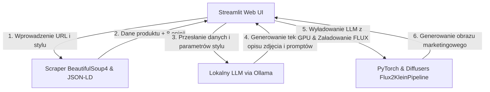

# E-Commerce Sales Description Optimizer (v0.2)

Projekt stanowi system klasy MVP wspierający sprzedawców internetowych w optymalizacji kart produktów (Product Detail Pages) poprzez ulepszanie opisów marketingowych i generowanie dedykowanych grafik reklamowych w modelu FLUX.

---

## Główne Cele i Funkcjonalności (v0.2)
1. **Scraping & Parsing:** Automatyczne pobieranie tytułów, oryginalnych opisów, specyfikacji technicznych oraz opinii klientów z portalu Amazon (priorytetowo poprzez tagi JSON-LD).
2. **Personalizacja stylu (Tone of Voice):** Wybór charakteru tekstu (Perswazyjny, Profesjonalny, Techniczny, Luźny) zintegrowany z promptami AI.
3. **Optymalizacja SEO:** Wdrażanie słów kluczowych pod pozycjonowanie w wyszukiwarkach bezpośrednio do treści opisu.
4. **Analiza Sentymentu i Obiekcji:** Automatyczne uwzględnianie najczęstszych zalet i zarzutów z recenzji kupujących w celu przekonania nowego klienta i obniżenia stóp zwrotów.
5. **Ulepszanie Grafiki (FLUX.2):** Przetwarzanie oryginalnego zdjęcia produktu w atrakcyjną grafikę typu lifestyle lub ujęcie studyjne bez konieczności kosztownych sesji zdjęciowych.

---

## Architektura i Przepływ Danych (v0.2)

- **Frontend:** Streamlit (zintegrowany z `st.session_state` w celu zapobiegania przeładowaniom danych).
- **Inference Engine (Tekst):** Ollama (`gemma3:4b` - Szybki, `gpt-oss:20b` - Zbalansowany, `gemma4:31b` - Precyzyjny).
- **Inference Engine (Grafika):** PyTorch + HuggingFace Diffusers (`black-forest-labs/FLUX.2-klein-4B`).
- **Zarządzanie Pamięcią:** Dynamiczne wyładowywanie modelu językowego przed generowaniem grafiki w celu uniknięcia błędów GPU VRAM (Out-of-Memory).

---

## Ewolucja Projektu: Porównanie Wersji v0.1 i v0.2

### Słabości v0.1, które zostały rozwiązane w v0.2:
1. **Brak zapisu stanu sesji (Rozwiązane):** Wersja v0.1 traciła dane po kliknięciu dowolnego przycisku lub zmianie widoku. W v0.2 zaimplementowano pełne wsparcie dla `st.session_state`, co pozwala na płynną edycję promptów i pobieranie wyników.
2. **Skomplikowane i techniczne opcje (Rozwiązane):** Z interfejsu usunięto parametry takie jak CFG, Guidance Scale, Seed czy Liczba kroków FLUX. Dodano uproszczony wybór modeli LLM według kryterium czasu oczekiwania.
3. **Brak kontroli nad copywritingiem i SEO (Rozwiązane):** Dodano listę rozwijaną z opisami stylów wypowiedzi (Tone of Voice) oraz pole do wplecenia słów kluczowych pod SEO.
4. **Zawieszanie się interfejsu (Rozwiązane):** Zastąpiono statyczne czekanie asynchronicznym streamingiem tekstu z Ollamy na żywo do elementu tekstowego UI.
5. **Niezoptymalizowana pamięć GPU (Rozwiązane):** Wprowadzono procedurę czyszczenia cache CUDA i uwalniania VRAM przy przełączaniu modeli LLM i FLUX, co umożliwia stabilne działanie na jednej konsumenckiej karcie graficznej.

### Pozostałe Wyzwania (Plany na wersję v0.3):
1. **Podatność na blokady anty-botowe:** Amazon blokuje zapytania ze standardowej biblioteki `httpx` przy częstym użytkowaniu (wymaga przejścia na zewnętrzne API scrapujące z rotacją proxy).
2. **Kolejkowanie zadań:** Brak serwera pośredniczącego powoduje, że jednoczesna praca kilku użytkowników na jednym lokalnym serwerze GPU doprowadzi do spowolnień i awarii (wymaga przejścia na architekturę FastAPI + Celery).
3. **Analiza asynchronicznych opinii:** Obecny scraper pobiera recenzje wyłącznie z głównego adresu URL produktu (pomija głębsze podstrony z opiniami).
